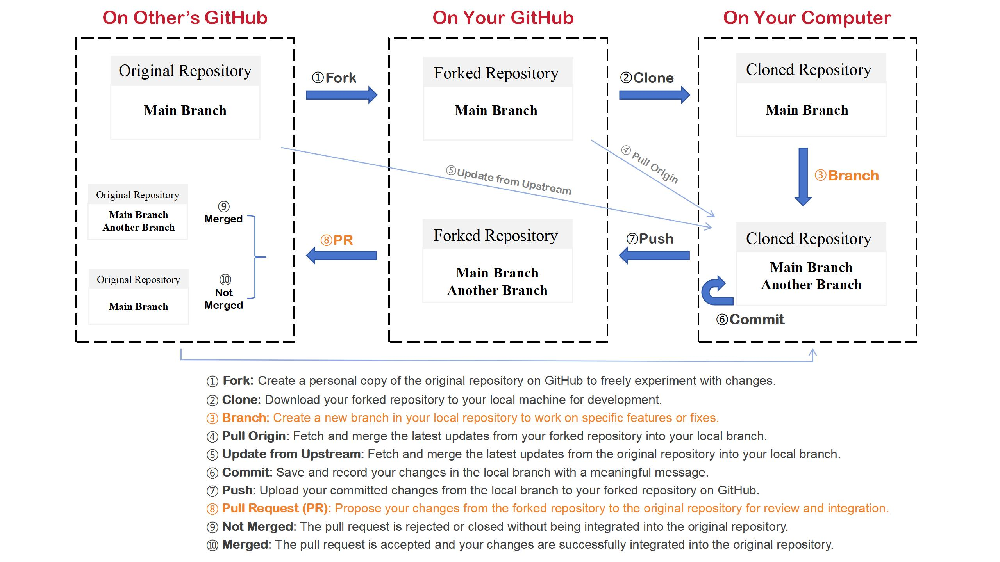

# A "Hello World" in Your Path to Technical Writing

## Docs-like-code workflow

the docs-like-code workflow is just like the Git workflow, but need to pay more attention to two steps: branch and PR.

///caption
Docs-like-code Workflow Chart
///

### About Branch

When creating a branch and followed any edition, you should strictly follow the project’s contribution guidelines. This includes not only technical details, such as naming conventions for branches, but also writing clear and meaningful commit messages, which are helpful for the project maintainers and other contributors. Here are some key points:

- **Branch Naming Rules:** Many projects have specific naming conventions to help identify the purpose of a branch. For example, using the feature/ prefix for new features or bugfix/ for bug fixes.
- **Guidline-orinted Editting** All editing operations, including adding, deleting, or modifying files, should be done according to best practices outlined in the contribution guidelines to ensure alignment with the project’s overall style and structure.
- **The Importance of Commit Messages:** Each commit message should clearly describe the changes made and the reason behind them. This helps other developers quickly understand your intent and simplifies the code review process.

### About Pull Request

Submitting a Pull Request (PR) is a critical step in contributing code to a project. Beyond ensuring the quality of the code itself, providing detailed PR information and applying appropriate labels are also crucial. Here are some guiding principles for submitting PRs:

- **Provide Detailed PR Information**: Offer a thorough description explaining why you made the changes, what problem they solve, and how to test them. This helps reviewers understand and evaluate your contribution more effectively.
- **Tag Relevant Labels**: Label the PR appropriately based on the nature of the changes (e.g., enhancement, bug, documentation). This helps project maintainers classify and prioritize PRs efficiently.
- **Follow the PR Template**: If the project provides a PR template, make sure to use it. It usually guides you to include necessary information, ensuring the PR has enough context and detail.

## A hands-on project

Now you can take your first step on your path to Technical Writing. It's just like a "Hello World" in Docs-like-code. We will take a demo project to experience a simple but whole-process docs-like-code workflow.

Now we'll practice this workflow. If you didn't watch the livestream, then you can follow this article to try.

[**How to contribut to a github repository**](https://blog.rayray.vip/2023/12/27/03-how-to-create-pull-request/){: .card-link }

!!! note "Note"
    You only need to change the targe repository from `pingcap/docs` to `tccqupt/hello-tc`.
