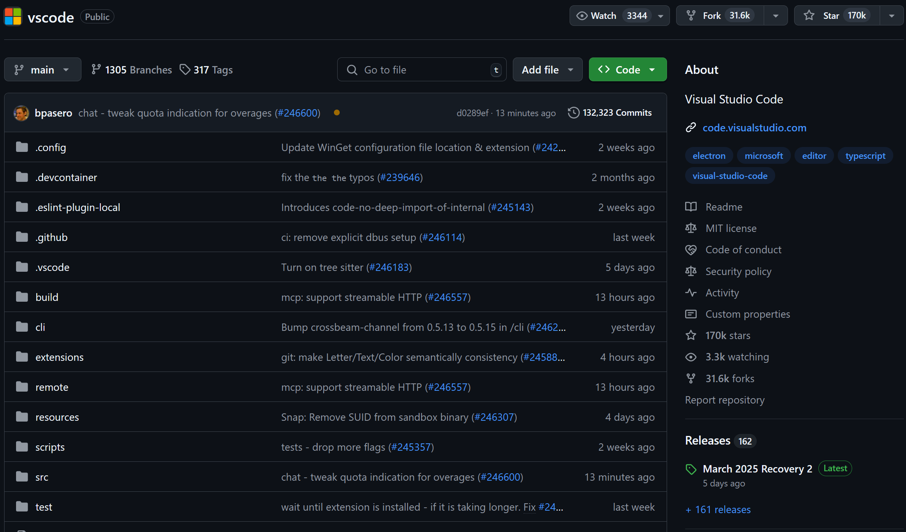

# Git & GitHub: Docs Like Code 的基础

本部分将简要介绍 Git 和 GitHub。

## 什么是 Git?

Git 是一种分布式版本控制系统，用于跟踪文件的变更，主要有两个用途：

1. **版本控制**

   Git 就像文件的“版本回溯工具”，记录你所做的每一次修改，从而让你能够：

    - **可以轻松恢复到之前的版本** ，如果当前状态出现问题。
    - **快速比较不同版本之间的变更**，以便更好地理解和追踪内容。
    - **保留项目的完整历史**, 确保所有更新都有据可查。

2. **协作**

   Git 使多人能够同时在同一项目上协作而不会发生冲突。其主要功能包括：

    - 分支管理: 创建独立分支，允许 **每个参与者独立工作** 不会影响他人的修改或主项目内容。
    - 合并: 将不同分支的修改无缝整合到主分支或其他目标分支，确保 **所有贡献都能顺利融合**.

    - 冲突解决: 当两人修改文件的同一部分时，Git 会帮助你**识别并解决冲突**, 保证最终的版本能够兼顾所有人的修改。

## 什么是GitHub?

GitHub 是基于 Git 构建的平台，提供协作和代码托管的工具：

- **托管仓库**: 将代码和文档存储在云端。
- **协作**: 通过拉取请求（Pull Requests）提交修改建议并讨论优化方案。
- **社交编程**: 为开源项目点赞（Star）、分叉（Fork）并参与贡献。

## 什么是开源?
开源就是把项目的源码公开，让大家都能自由查看、改进和分享。这样做带来了很多好处，比如：

- **创新**: 促进协作与思想交流。
- **质量**: 更多人参与审查代码，减少错误，提升解决方案。
- **社区**: 打造全球范围的贡献者和用户网络。

### 著名的开源项目

以下是一些你可能听说过的著名开源项目：

=== "Anki"
    
=== "DeepSeek"
    
=== "VS Code"
    
=== "LanguageTool"
    

## Git 和 GitHub 与 Docs Like Code 的关系

在 Docs Like Code 工作流程中：

- **Git** 用于对文档进行版本控制，就像管理代码一样。
- **GitHub** 提供协作平台，支持多名贡献者共同编辑同一份文档。
- **开源原则**与 Docs Like Code 不谋而合：强调透明、协作与共享。
