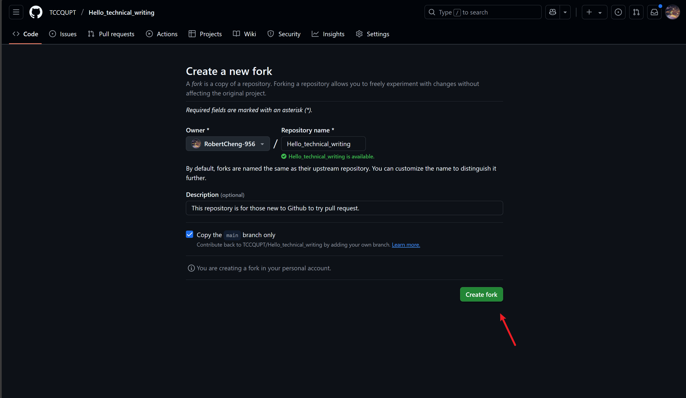
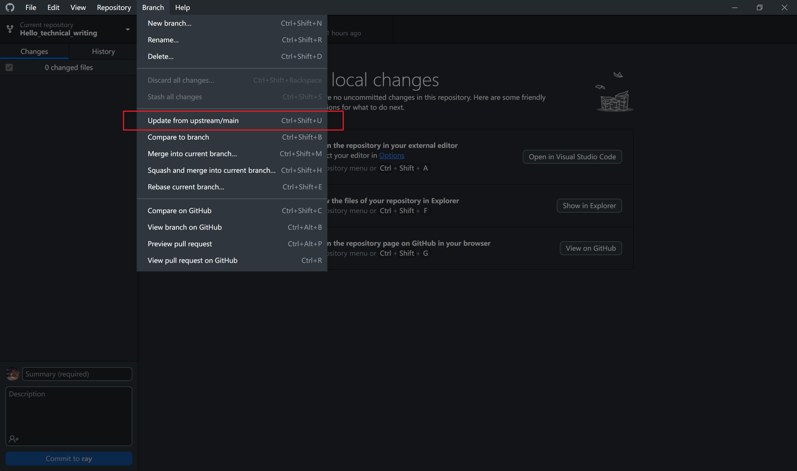
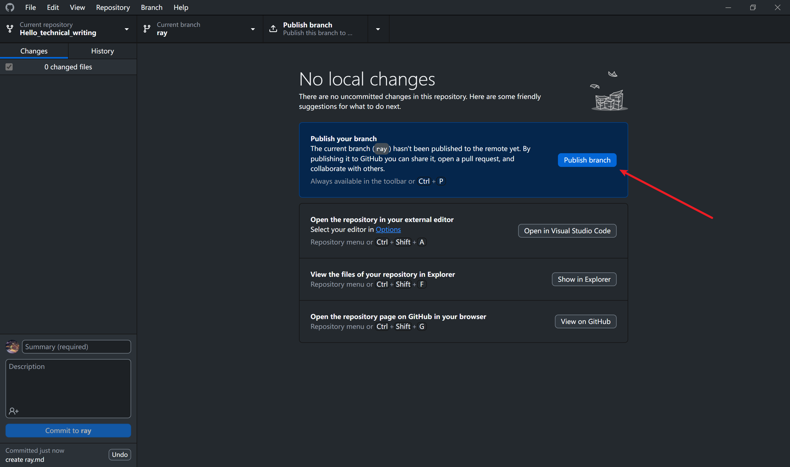

#  技术写作之路——“Hello，World”

## 文档即代码工作流

文档即代码的工作流程与 Git 工作流程类似，但有两个步骤需要格外关注：一个是分支（branch），一个是拉取请求（PR）。

///caption
文档即代码工作流程图
///

### 分支那些事儿

在创建分支进行编辑时，你应严格遵循项目的贡献指南。指南中不仅包括技术细节（如分支命名规范），还包括编写清晰且有意义的提交信息，这些内容能大大帮助项目维护者和其他贡献者。以下是一些关键点：

- **分支命名规则:**   许多项目都有特定的命名规范，以帮助识别分支的用途。例如，使用 feature/ 前缀表示新功能，或用 bugfix/ 表示 bug 修复。
- **指南导向的编辑** 所有包括添加、删除或修改文件的编辑操作，均应按照贡献指南中概述的最佳实践执行，确保与项目的整体风格和结构保持一致。
- **提交信息的重要性:** 提交的每条信息都应清晰描述你所做的变更及其背后的原因。这有助于其他开发人员快速理解你的意图，并简化代码审查流程

### 拉取请求那些事儿

提交拉取请求（PR）是项目贡献代码的关键步骤。除了确保代码本身的质量外，提供详细的 PR 信息并贴上适当的标签也至关重要。以下是提交 PR 的一些指导原则：

- **提供详细的 PR 信息**: 你需要进行全面的描述，解释你为何要变更、这些变更解决了什么问题，以及如何测试这些变更方法。这有助于审核者更有效地理解和评估你的贡献。
- **标记相关标签**: 根据变更的性质（如增强功能、修复漏洞、文档更新）为 PR 添加适当的标签。这有助于项目维护者高效地对 PR 进行分类和优先级排序。
- **遵循 PR 模板**: 如果项目提供了 PR 模板，请务必使用此模版。因为模板通常会引导你包含必要的信息，确保 PR 具备足够的背景和细节。

## 实操项目

现在，你可以迈出技术写作之路上的第一步了。这就像是文档即代码领域的 “Hello World”。我们将通过一个演示项目来体验一个简单但完整的文档即代码工作流程。

现在我们将练习这个工作流程。如果您没有观看直播，那么可以按照这部分内容来尝试。

1. **阅读贡献指南**
    
2. **“复制原始仓库**
    
    
      
3. **将复制的仓库克隆到本地计算机**
    
    
    
4. **创建一个分支**
    
    
    
5. **从上游仓库（原始仓库）更新**
    
6. **开始贡献**
    
7. **从分支仓库中拉取变更到本地环境（较少使用）**
8. **提交你的变更**
    
9. **将变更推送到分支仓库**
    
10. **创建拉取请求（Pull Request），以向原始仓库提交你的变更**
    
    
11. **等待维护者对你的提交进行审核并提供反馈**
    
