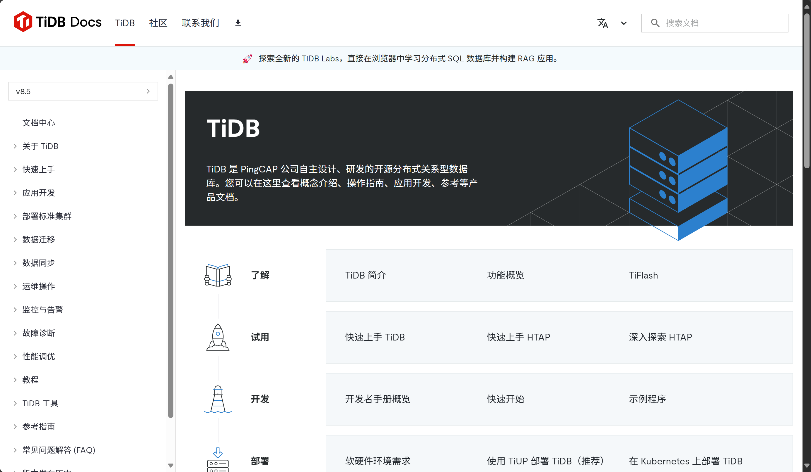

# 实操翻译项目

接着我将介绍一些你可以尝试参与的实际翻译项目

## PingCap/TiDB - docs

 PingCAP 组织下有两个 TiDB 的文档项目：[English](https://github.com/pingcap/docs)  和 [Chinese](https://github.com/pingcap/docs-cn)。对于这两个文档项目，我们可以通过多种方式进行贡献。我们可以将文档从中文翻译成英文，或者英文翻译成中文。此外，我们还可以识别并修正文档中的写作错误，比如错误描述的操作步骤。记得根据其[Contribution Guidelines](https://github.com/pingcap/docs/blob/master/CONTRIBUTING.md)进行编辑。

## FOSScope

在 GitHub 上找到的 FOSScope TranslateProject 旨在进行海外文章的中英翻译，涉及的类别包括讲座、新闻、技术等。我们可以通过选择`source` 文件夹中待翻译的文章进行贡献，并按照[Contribution Guidelines](https://fosscope.com/wiki/fosscope-workflow/translation-workflow)进行编辑。以下图片是该项目的官方网站，在这里你可以阅读一些已翻译的文章。

## Docs-like-code 中文本地化

这个项目旨在将英文网站“Docs-like-code”翻译成中文。贡献者可以通过翻译文章、审查翻译内容，并确保本地化的内容与原文保持相同的质量来参与。此外，你还可以通过识别并修正网站上的任何错误来进行贡献。
